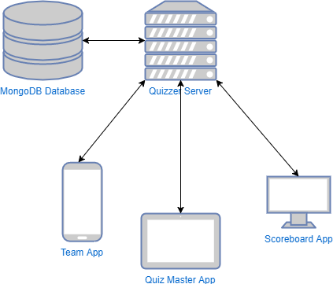
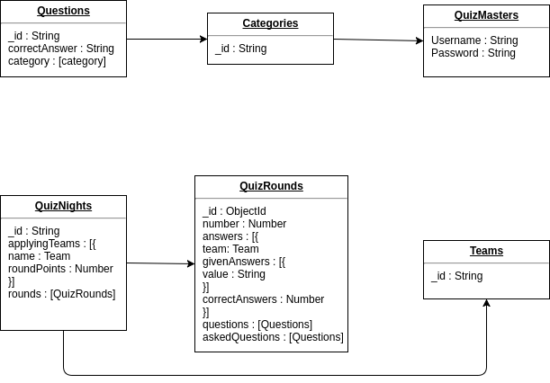

# Quizzer Design Document

The Quizzer is a web application that can be used to organize quizzes in which participants can play in teams. A pub quiz, basically.
In order to run Quizzer locally, 4 "sub" applications and a single database are needed. The sub applications are technically two web applications, a scoreboard and a server.

**Web application 1: Team app**  
The application in which teams can join a quiz and submit answers.

**Web application 2: Quizzer master app**  
The app in which the quizmaster can start and manage a quiz sessions. the master has control over when the quiz starts and ends, who joins the quiz, which answers will be asked and which of them are correct.

**Scoreboard**  
The Quizzer's scoreboard displays the current scores of the participating teams during and after the quiz. 

**Server**  
The server within Quizzer keeps hold of the current quiz session. It keeps every sub application up to date with the quiz session's current data.

**Database**  
The database within Quizzer is used to temporarily cache data about the quiz, so it can be recovered if something goes wrong (immediate server crash).  

## Architecture

The clients primarily use websocket connections for all communication. HTTP requests are only used for retrieving data from the MongoDB backend.



## API Spec & Websocket Message formats

The text below describes the REST api specification of the server. Which endpoints can be accessed, by which url and what there responses look like.

### REST

The paragraph below lists each REST endpoint which can be accessed from the Quizzer's server.

#### List question categories

List all the question's categories which can be used in the quiz.

```GET /categories```

##### Response

```
{
  "name": String
}
```

#### List available questions

List all questions of which the quiz master can choose to ask during a quiz session.

```GET /questions```

##### Response

```
{
  [
    {
      "name" : String,
      "category" : String,
      "correctAnswer" : String
    }
  ]
}
```

### Websocket

This paragraph lists all the websocket messages which can be sent to and retrieved from the Quizzer's server during a quiz.

#### Team App messages to server

These are the messages currently being send from the Team app to the server within Quizzer.

##### Apply for Quiz Night

```
{
  quizNightCode: String
  teamName: String
  messageType: teamApplication
}
```

##### Sending answers

```
{
  quizNightCode: String
  teamName: String
  answer: String
  messageType: sendAnswer
}
```

#### Team App messages from server

These are the messages currently being send from the server to the Team app.

##### Team Approval status

```
{
  Approved: Boolean
  messageType QuizNightApprovalStatus
}
```

##### Receiving questions

```
{
  category: String
  question: String
  roundNumber: Number
  questionNumber: Number
  messageType: receiveQuestion
}
```
#### Scoreboard App messages from server

These are the messages currently being send from the Team app to the server.

##### Scoreboard Overview
```
{
  roundNumber: Number
  questionNumber: Number
  teams: [{
    teamName: String
    roundPoints: Number
    correctAnswers: Number
  }]
  messageType: QuizNightScoreOverview
}
```
##### Question Overview
```
{
  category: String
  question: String
  teams: [{
    teamName: String
    hasSuppliedAnswer: Boolean
  }]
  messageType: QuestionScoreOverview
}
```
##### Question Overview Answers
```
{
  category: String
  question: String
  teams: [{
    teamName: String
    SuppliedAnswer: String
  }]
  messageType: QuestionScoreOverviewWithAnswers
}
```
#### QuizMaster App messages to server

These are the messages currently being send from the QuizMaster app to the server.

##### Question to ask

```
{
  question: String
  category: String
  messageType: AskQuestion
}
```
#### QuizMaster App messages from server

These are the messages currently being send from the server to the QuizMaster app.

##### Start quiz night

```
{
  quizNightCode: String
  messageType: StartQuizNight
}
```
##### Team Applications

```
{
  teamName: String
  messageType: TeamApplication
}
```
##### Closing Question

```
{
  correctAnswer: String
  messageType: correctAnswer
}
```

##### Submitted Answers

```
{
  teamName: String
  answer: String
  question: String
  category: String
  messageType: SubmittedAnswer
}
```


### Database structure

The diagram below shows the structure of the MongoDB database. It shows which collections exist and which relations they have.



## Technologies

|Tech|Description|Rationale|
|----|-----------|---------|
|Node.js|Node.js® is a JavaScript runtime built on Chrome's V8 JavaScript engine.||
|Express|Fast, unopinionated, minimalist web framework for Node.js.||
|React|Fast, composable client-side components.||
|MongoDB|MongoDB is an open-source, document database designed for ease of development and scaling.||
|Websocket|A computer communications protocol, providing full-duplex communication channels over a single TCP connection.||
|Mongoose|Mongoose is a MongoDB object modeling tool designed to work in an asynchronous environment.|For easy schema creation and validation|
|React UIkit Components|Collection of React components using the UIkit CSS framework.|The programmers have more experience with UIkit|
|Axios|Promise based HTTP client for the browser and node.js.|To prevent callback hell.|
|Mocha Test|Mocha is a feature-rich JavaScript test framework running on Node.js and in the browser, making asynchronous testing simple and fun.||
|Chai|Chai is a BDD / TDD assertion library for node and the browser that can be delightfully paired with any javascript testing framework.|For more readable tests|
|Supertest|The motivation with this module is to provide a high-level abstraction for testing HTTP, while still allowing you to drop down to the lower-level API provided by superagent.||
|SocketIO|Socket.IO enables real-time bidirectional event-based communication.||

