# Quizzer Design Document

Welcome to Quizzer. Quizzer is a web application that can be used in bars, sports and canteens to play quizzes as a team. A quiz game (also called a _quiz night_) is hosted by the quiz master, who reviews submitted answers by each team and decides how many rounds a game takes. Anyone can be quiz master and host an evening full of joy!

## Getting started
Quizzer is devided into 4 code bases:

- **Web application 1: Team app**, The application in which teams can join a quiz and submit answers.

- **Web application 2: Quizzer master app**, The app in which the quizmaster can start and manage a quiz session..

- **Web application 3: Scoreboard**, The Quizzer's scoreboard displays the current scores of the participating teams during and after the quiz.

- **Backend server**, A RESTful API written in Node.js (more detailed documententation can be found _here_). It also contains websockets.
 

## Architecture

HTTP requests are used for static data, websockets connections for dynamic data. this way static data like team names or questions can be cached during a quiz night or round. since dynamic data changes during a round or quiz night caching it isn’t useful enough. For example if the team names aren’t cached the scoreboard would keep refreshing the team names even though they haven’t changed during the quiz night.


## Domain model
The model below is is an overview of all the domain concepts mentioned in the Quizzer case study:


## The Websocket Interface
Now that we have our models, let's look at which events occur during a Quiz Night and which messages are sent between clients and servers over the websocket protocol.

**Messages from QuizzerApp to server:**

Event | Message type
------------- | -------------
Team signed up | ```{messageType: "CONNECT_TEAM", password: "", name: ""} ```
Submit answer | ```{messageType: "SUBMIT_ANSWER", questionId: "", answer: "" } ```


**Messages from QuizmasterApp to server:**

Event | Message type
------------- | -------------
Quizmaster signup | ```{messageType: "CONNECT_QUIZMASTER", password: "", name: ""} ```
Accept team | ```{messageType: "ACCEPT_TEAM", teamName:"", accepted: boolean} ```
Start round | ```{messageType: "START_ROUND", categories:[{}], questions:[{}]} ```
Close Question | ```{messageType: "CLOSE_QUESTION", round:"", question_id:''}```
Review answer | ```{messageType: "UPDATE_SCORE", round: "", score:"", teamName:""} ```
End quiz night | ```{messageType: "END_GAME"} ```


**Messages from Scoreboard to server:**

Event | Message type
------------- | -------------
Scoreboard Signup | ```{messageType: "CONNECT_SCOREBOARD", password: ""} ```


**Messages from server to QuizzerApp:**

Event | Message type
------------- | -------------
Can not sign up | ```{messageType: "SIGN_UP_ERROR"} ```
Pending for anything (such as waiting for new rounds) | ```{messageType: "PENDING", message""} ```
Answer to question has been reviewed | ```{messageType: "ANSWER_REVIEWED", isCorrect""} ```
New Question Starts | ```{messageType: "New Question", question:""} ```
End quiz night | ```{messageType: "END_GAME"}```


**Messages from server to QuizmasterApp**

Event | Message type
------------- | -------------
Can not sign up | ```{messageType: "SIGN_UP_ERROR"} ```
New Round Started | ```{messageType: "NEW_ROUND_STARTED, round:{} ```
New Question Received for current round | ```{messageType: "NEW_QUESITON", question:{} }```
Answer Submitted | ```{messageType: "ANSWER_SUBMITTED", answer:"", teamName:""} ```
Answer Re-submitted | ```{messageType: "ANSWER_SUBMITTED", answer:"", teamName:""} ``` 
Answer submitted by team | ```{messageType: "ANSWER_SUBMITTED"} teamName:  ```


**Messages from server to Scoreboard**
Current round
Score update


## API Specifications

The text below describes the REST api specification of the server. Which endpoints can be accessed, by which url and what there responses look like.

### REST

The paragraph below lists each REST endpoint which can be accessed from the Quizzer's server.

#### List question categories

List all the question's categories which can be used in the quiz.

```GET /categories```

##### Response

```
{
  "name": String
}
```

#### List available questions

List all questions of which the quiz master can choose to ask during a quiz session.

```GET /questions```

##### Response

```
{
  [
    {
      "name" : String,
      "category" : String,
      "correctAnswer" : String
    }
  ]
}
```

#### List applying teams in quiz

List all applying teams in the quiz.

```GET /teams```

##### Response

```
{
  [
    {
      "name" : String
    }
  ]
}
```

#### Apply for a quiz

Apply as a team for a quiz. The team needs to know the correct quiz night code to apply.

```POST /teams```

##### Body

```
{
  {
    "name" : String,
    "quizNightCode" : String
  }
}
```

### Database structure

The diagram below shows the structure of the MongoDB database. It shows which collections exist and which relations they have.


## Technologies

|Tech|Description|Rationale|
|----|-----------|---------|
|Node.js|Node.js® is a JavaScript runtime built on Chrome's V8 JavaScript engine.||
|Express|Fast, unopinionated, minimalist web framework for Node.js.||
|React|Fast, composable client-side components.||
|MongoDB|MongoDB is an open-source, document database designed for ease of development and scaling.||
|Websocket|A computer communications protocol, providing full-duplex communication channels over a single TCP connection.||
|Mongoose|Mongoose is a MongoDB object modeling tool designed to work in an asynchronous environment.|For easy schema creation and validation|
|React UIkit Components|Collection of React components using the UIkit CSS framework.|The programmers have more experience with UIkit|
|Axios|Promise based HTTP client for the browser and node.js.|To prevent callback hell.|
|Mocha Test|Mocha is a feature-rich JavaScript test framework running on Node.js and in the browser, making asynchronous testing simple and fun.||
|Chai|Chai is a BDD / TDD assertion library for node and the browser that can be delightfully paired with any javascript testing framework.|For more readable tests|
|Supertest|The motivation with this module is to provide a high-level abstraction for testing HTTP, while still allowing you to drop down to the lower-level API provided by superagent.||
|SocketIO|Socket.IO enables real-time bidirectional event-based communication.||

## User Interface
The wireframes for the 3 apps are under this heading.

### Team App

#### Applying for quiz night
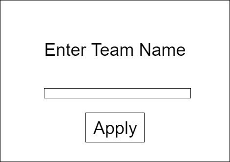

#### Answering questions
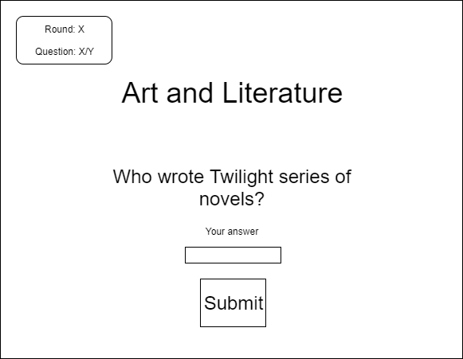

### Quiz Master App

#### Starting Quiz Night
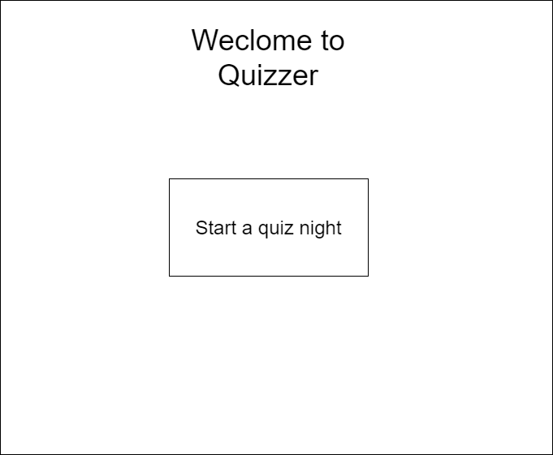

#### Waiting for team applications
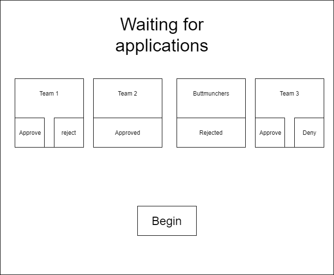

#### Starting quiz round
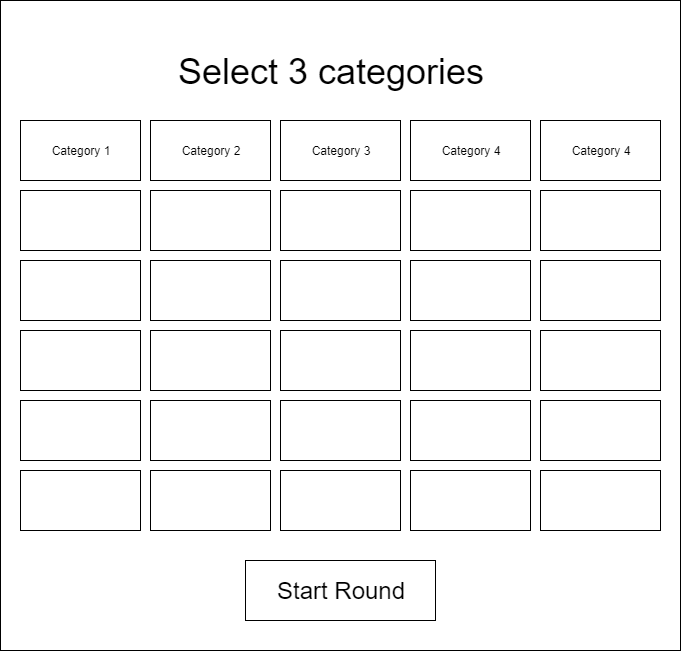

#### Select round questions
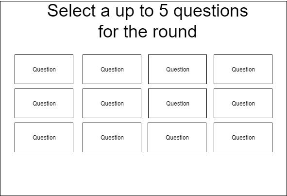

#### Check answers
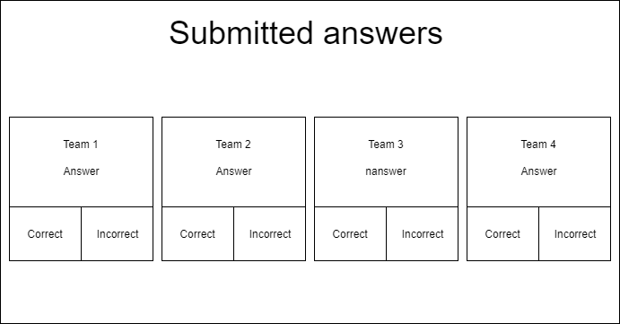

#### End Round
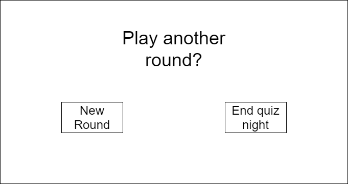


### Scoreboard App

#### Scoreboard Overview
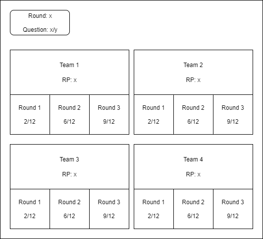

#### Scoreboard current question
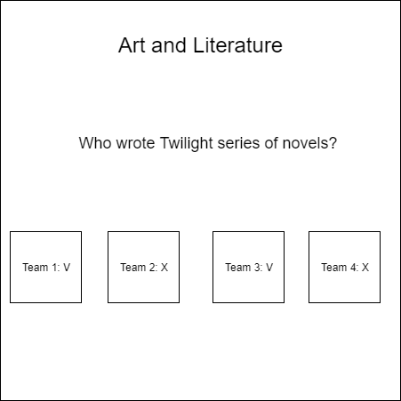

#### Scoreboard team answers
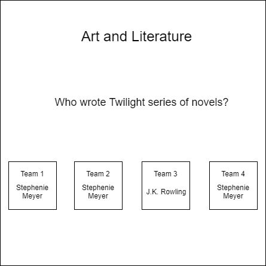
