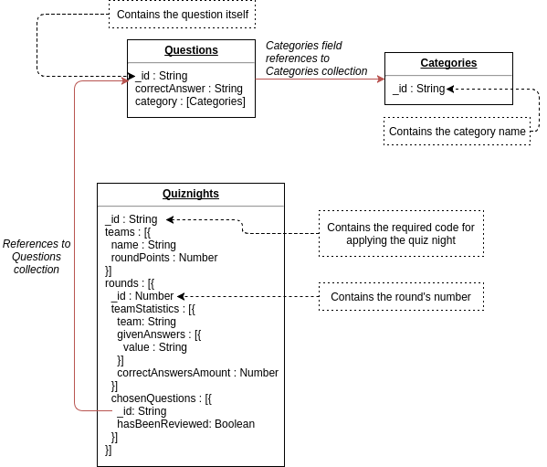

# Quizzer Design Document

Welcome to Quizzer. Quizzer is a web application that can be used in bars, sports and canteens to play quizzes as a team. A quiz game (also called a _quiz night_) is hosted by the quiz master, who reviews submitted answers by each team and decides how many rounds a game takes. Anyone can be quiz master and host an evening full of joy!

## Getting started
Quizzer is devided into 4 code bases:

- **Web application 1: Team app**, The application in which teams can join a quiz and submit answers.

- **Web application 2: Quizzer master app**, The app in which the quizmaster can start and manage a quiz session..

- **Web application 3: Scoreboard**, The Quizzer's scoreboard displays the current scores of the participating teams during and after the quiz.

- **Backend server**, A RESTful API written in Node.js (more detailed documententation can be found _here_). It also contains websockets.
 

## Architecture

HTTP requests are used for static data, websockets connections for dynamic data. this way static data like team names or questions can be cached during a quiz night or round. since dynamic data changes during a round or quiz night caching it isn’t useful enough. For example if the team names aren’t cached the scoreboard would keep refreshing the team names even though they haven’t changed during the quiz night.


## Domain model
The model below is is an overview of all the domain concepts mentioned in the Quizzer case study:


### Database structure

The diagram below shows the structure of the MongoDB database. It shows which collections exist and which relations they have.



### Model rationale
For this situation we considered two factors:
1. Will the entities on the “N” side of the One-to-N ever need to stand alone?
2. What is the cardinality of the relationship: is it one-to-few; one-to-many; or one-to-squillions?

Regarding point one: As is shown in the domain model, we'll be dealing with a lot of one-to-N relationships.
The most important ones are:
- A quiz night has multiple teams
- A quiz night has multiple rounds
- A Round has multiple questions

**Regarding point two:** Only the _question_ collection needs to stand alone, as we expect new questions to be submitted, updated and deleted during the entire lifetime of this application. Also questions need to be queried on independently to fill a round with questions (within a specific category).

**That leaves us to one remaining issue:** embed _question_ inside quiz night or use a reference?
Denormalizing saves you a lookup of the denormalized data at the cost of a more expensive update. We assume that once a question is submitted, it's not very likely that an answer or category changes so we could embed it.

Source: [MongoDB rules of thumb for mongodb schema design](https://www.mongodb.com/blog/post/6-rules-of-thumb-for-mongodb-schema-design-part-1)


## The Websocket Interface
Now that we have our models, let's look at which events occur during a Quiz Night and which messages are sent between clients and servers over the websocket protocol.

**Messages from TeamApp to server:**

Event | Message type
------------- | -------------
Team signed up | ```{messageType: "CONNECT_TEAM", teamName: String} ```
Submit answer | ```{messageType: "SUBMIT_ANSWER", teamName: String, round: Number, question: String, answer: String } ```


**Messages from QuizmasterApp to server:**

Event | Message type
------------- | -------------
Quizmaster signup | ```{messageType: "CONNECT_QUIZMASTER"} ```
Accept team | ```{messageType: "ACCEPT_TEAM", team: {teamName: String, socketId: string, isAccepted: boolean} ```
Start round | ```{messageType: "START_ROUND"} ```
Next Question | ```{messageType: "NEXT_QUESTION", question: {_id: String, category: String}```
Close Question | ```{messageType: "CLOSE_QUESTION", question:String}```
Submit answers review | ```{messageType: "UPDATE_SCORE", round: Number, question: String, correctAnswer: String, givenAnswers: [{teamName: String, answer: String, isCorrect: Boolean}] }```
End round | ```{messageType: "END_ROUND"}```
End quiz night | ```{messageType: "END_GAME"} ```


**Messages from Scoreboard to server:**

Event | Message type
------------- | -------------
Scoreboard Signup | ```{messageType: "CONNECT_SCOREBOARD"} ```


**Messages from server to TeamApp:**

Event | Message type
------------- | -------------
Can not sign up | ```{messageType: "SIGN_UP_ERROR"} ```
Pending for anything (such as waiting for new rounds) | ```{messageType: "PENDING", String} ```
Allowed to join quiznight | ```{messageType: "TEAM_ALLOWED", isAccepted: Boolean} ```
Answer to question has been reviewed | ```{messageType: "ANSWER_REVIEWED", correctAnswer: String, isCorrect: Boolean} ```
New Question Starts | ```{messageType: "NEW_QUESTION", question: String, category: String} ```
End quiz night | ```{messageType: "END_GAME"}```


**Messages from server to QuizmasterApp**

Event | Message type
------------- | -------------
Can not sign up | ```{messageType: "SIGN_UP_ERROR"} ```
Pending for anything | ```{messageType: "PENDING", String} ```
Team joined | ```{ messageType: "TEAM_JOINED", teamName: String, socketId: String }```
New Question Received for current round | ```{messageType: "NEW_QUESTION", question:String }```
Answer Submitted | ```{messageType: "ANSWER_SUBMITTED", question: String, answer: String} ```


**Messages from server to Scoreboard**

Event | Message type
------------- | -------------
Score overview | ```{messageType: "SHOW_SCORES", teams: [{name: String, roundPoints: Number, score: {round: Number, questionsCorrect: Number}}]} ```
Question answer overview | ```{messageType: "SHOW_QUESTION_RESULTS", question: {question: String, category: String}, teams: [{teamName: String, givenAnswer: String}]} ```
New question overview | ```{messageType: "NEW_QUESTION", question: {question: String, category: String}, teams: [{teamName: String, givenAnswer: String, hasAnswered: false}]} ```
Answer submitted | ```{messageType: "ANSWER_SUBMITTED", teamName: String, hasAnswered: Boolean}```


## API specification

### Questions

 - GET  /questions  ```// fetch all questions ```

Filter params: ?category: string, ?random: boolean, ?limit: number

### Categories

- GET /categories ```/// fetch all categories ```

### Quiznight

- POST /quiznights/:id/rounds/:roundId ```// create questions for a new round in a quiznight ```
``` body: [Questions] ```
- GET  /quiznights ```// get all quiznights ```
- POST /quiznights ```// create new quiznight ```


## Technologies

|Tech|Description|Rationale|
|----|-----------|---------|
|React UIkit Components|Collection of React components using the UIkit CSS framework.|The programmers have more experience with UIkit|
|Axios|Promise based HTTP client for the browser and node.js.|To prevent callback hell.| easy to use and experienced with it
|Mocha Test|Mocha is a feature-rich JavaScript test framework running on Node.js and in the browser, making asynchronous testing simple and fun.||
|Chai|Chai is a BDD / TDD assertion library for node and the browser that can be delightfully paired with any javascript testing framework.|For more readable tests|
|Supertest|The motivation with this module is to provide a high-level abstraction for testing HTTP, while still allowing you to drop down to the lower-level API provided by superagent.||
|SocketIO|Socket.IO enables real-time bidirectional event-based communication.|| Let's learn something!!
|Redux|Predictable state container for appstate management|| To introduce structure in our application

## User Interface
The wireframes for the 3 apps are under this heading.

### Team App

#### Applying for quiz night


#### Answering questions


### Quiz Master App

#### Starting Quiz Night


#### Waiting for team applications


#### Starting quiz round


#### Select round questions


#### Check answers


#### End Round


### Scoreboard App

#### Scoreboard Overview


#### Scoreboard current question


#### Scoreboard team answers

